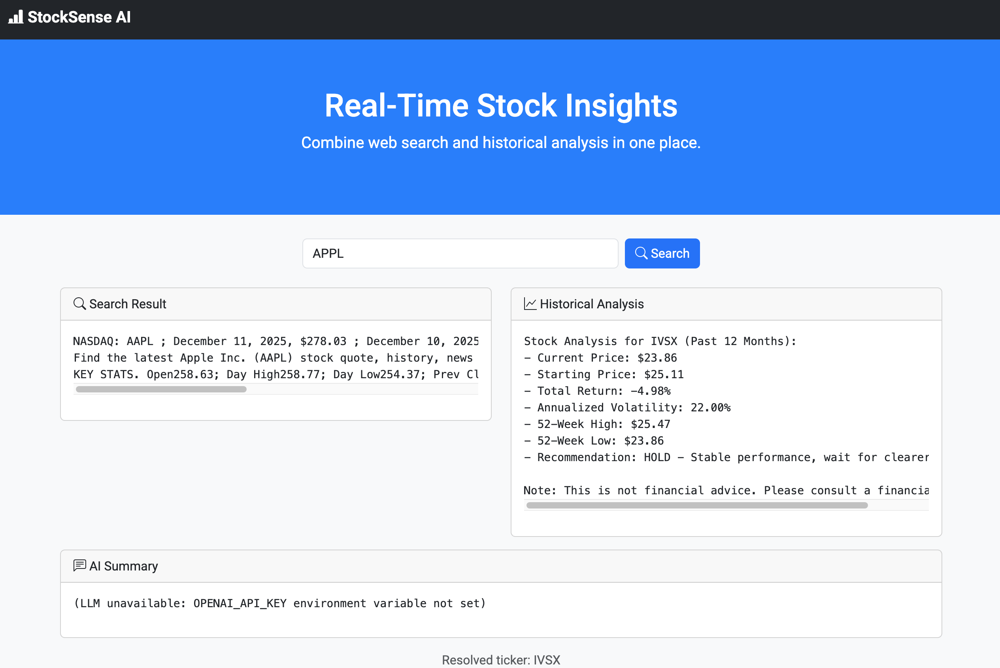

# StockSense AI

## About StockSense AI

StockSense AI is an intelligent stock analysis web application that combines real-time web search with historical market data analysis. It provides comprehensive stock insights including current prices, performance metrics, and AI-powered summaries.

The application features a modern web interface built with Flask and Bootstrap, allowing users to query stock information seamlessly.

## Features

- **Real-time Search**: Fetches latest stock prices and news using Google Search API
- **Historical Analysis**: Analyzes stock performance over the past 12 months using Yahoo Finance data
- **AI Summaries**: Optional OpenAI-powered natural language summaries (requires API key)
- **Responsive Web UI**: Clean, modern interface with loading indicators and error handling
- **Command-line Demo**: Standalone script for testing functionality

## Demo
<p align="center">
  
</p>

## Setup

1. **Get API Keys**:
   - Serper API Key: Sign up at [Serper.dev](https://serper.dev) for Google search access
   - (Optional) OpenAI API Key: For AI summaries at [OpenAI](https://platform.openai.com)

2. **Create `.env` file** in the project root:
   ```
   SERPER_API_KEY=your_serper_api_key_here
   OPENAI_API_KEY=your_openai_api_key_here  # Optional
   ```

3. **Install dependencies**:
   ```bash
   pip3 install requests python-dotenv yfinance flask openai
   ```

## Run

### Web Application
```bash
python3 app.py
```
The app will start on `http://localhost:5003` (or next available port). Open in your browser to use the web interface.

### Command-line Demo
```bash
python3 demo.py
```
Runs a simulation of the AI tool-calling process for a sample query.

## Usage

- Enter a stock ticker (e.g., AAPL) or company name (e.g., Apple) in the search box
- The app will display search results, historical analysis, and AI summary
- Analysis includes price changes, volatility, and buy/hold/sell recommendations

## Architecture

- **Backend**: Flask web server with REST API endpoints
- **Frontend**: HTML/CSS/JavaScript with Bootstrap 5
- **APIs**: Serper for search, Yahoo Finance for data, OpenAI for summaries
- **Deployment**: Runs locally with debug mode enabled

## Notes

- Financial data is for informational purposes only
- Consult a financial advisor before making investment decisions
- API rate limits apply to search and AI services

Example environment file additions:

```
OPENAI_API_KEY=sk-...
```

### Web interface

A minimal Flask application is included under `app.py` that serves a simple front‑end page.

```bash
# start the server (listens on port 5003 by default to avoid common macOS conflicts)
python3 app.py
```

Open your browser at <http://localhost:5003> and enter a stock ticker (e.g. `AAPL`) or a common company name (e.g. `Apple`). The app will attempt to resolve the input to an actual ticker symbol before fetching historical data.

The front‑end uses Bootstrap for a polished, commercial‑style appearance. It includes a navbar, hero section, and card‑based results that look like a production web app.

Requests are now sent asynchronously via AJAX; the page no longer reloads, and a spinner overlay shows progress when a search is in-flight. If you ever see the browser's own loading indicator (tab spinner) continuously spinning before the page appears, that means the Flask server hasn't successfully started or the chosen port is blocked.

The server now automatically tries up to ten consecutive ports beginning with the default (5003) to avoid common macOS conflicts. If every preferred port is busy it will fall back to an ephemeral port chosen by the OS. In either case the chosen port is printed on startup, so you can open the browser to that port (e.g. `http://localhost:5007`).

You can override the port by setting the `PORT` environment variable:

```bash
PORT=5004 python3 app.py
```
## Example Output

```
User asks: What is NVIDIA's stock price today?
AI thinks: My training data doesn't have today's real-time stock price information.
AI action: Generates a tool_call to invoke Google Search(query="NVIDIA stock price today").
Program: Fetches search results from the web (e.g., Find the latest NVIDIA Corporation (NVDA) stock quote...).
AI thinks: Now I should analyze the stock's historical performance for better context.
Program: Performs analysis of past 12 months performance.
AI response: Based on the latest information I just queried, NVIDIA's stock price today is approximately Find the latest NVIDIA Corporation (NVDA) stock quote...

Stock Analysis for NVDA (Past 12 Months):
- Current Price: $177.82
- Starting Price: $115.72
- Total Return: 53.67%
- Annualized Volatility: 41.94%
- 52-Week High: $207.03
- 52-Week Low: $94.29
- Recommendation: HOLD - Decent returns, monitor closely

Note: This is not financial advice. Please consult a financial advisor.
```

## File Description

- `search.py`: Contains the Google search function
- `tool_schema.json`: JSON schema definition for the tool
- `demo.py`: Main program simulating AI tool calls# StockSense-AI
